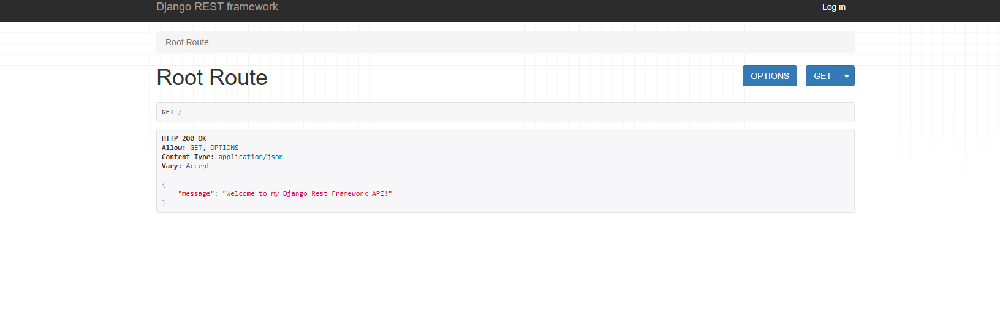

# DRESTF-API

This project is a Django REST framework (DRF) API designed to provide backend functionality for a social media platform that supports user interactions through comments, likes, follows, and posts. The API also includes features for managing user profiles and products, offering endpoints for various actions, including authentication, CRUD operations for posts, and social interactions between users.

## Root Page

The following image shows the root page of the API, providing a welcome message. Users can access the root route to verify the API is running and view a basic JSON response.



[⬆️ Back to Top](#top)

## Project Structure

- [Comments App](#comments-app)
- [Followers App](#followers-app)
- [Likes App](#likes-app)
- [Posts App](#posts-app)
- [Products App](#products-app)
- [Profiles App](#profiles-app)
- [Core API (drf_api)](#core-api-drf_api)
- [Project Dependencies](#project-dependencies)
- [Deployment](#deployment)
- [Testing](#testing)


## Additional Files

- **.gitignore** - Specifies files and directories that Git should ignore (e.g., environment files, compiled code).
    
- **env.py** - Contains environment variables, such as sensitive credentials or configuration variables, required for local development.
  
- **manage.py** - A command-line utility that lets you interact with this Django project in various ways (e.g., running the server, migrating the database).
  
- **Procfile** - Used to declare the commands to run the app on a hosting platform (such as Heroku).
  
  
## 📝Comments App

The `comments` app in this project handles user comments on posts. It includes models, serializers, views, and URL configurations to support CRUD operations for comments, allowing users to create, view, edit, and delete comments.

### Models

The `Comment` model represents a comment that a user can post on a specific post. It includes fields to associate each comment with a user and a post, as well as timestamp fields to track when the comment was created and last updated.

```python
from django.db import models
from django.contrib.auth.models import User
from posts.models import Post


class Comment(models.Model):
    """
    Comment model, related to User and Post
    """

    CATEGORY_CHOICES = [
        ('general', 'General'),
        ('question', 'Question'),
        ('tip', 'Tip'),
    ]

    owner = models.ForeignKey(User, on_delete=models.CASCADE)
    post = models.ForeignKey(Post, on_delete=models.CASCADE)
    created_at = models.DateTimeField(auto_now_add=True)
    updated_at = models.DateTimeField(auto_now=True)
    content = models.TextField()
    category = models.CharField(
        max_length=50, 
        choices=CATEGORY_CHOICES, 
        default='general',
    )

    class Meta:
        ordering = ["-created_at", "category"]

    def __str__(self):
        return f"{self.owner.username} - {self.get_category_display()}"
```

#### Fields:

- **`owner`**:  
  - **Type**: ForeignKey  
  - **Related Model**: User  
  - **Description**: The user who created the comment.  
  - **Behavior**: `on_delete=models.CASCADE` ensures the comment is deleted when the user is removed.  

- **`post`**:  
  - **Type**: ForeignKey  
  - **Related Model**: Post  
  - **Description**: The post to which the comment belongs.  
  - **Behavior**: `on_delete=models.CASCADE` ensures the comment is removed when the related post is deleted.  

- **`created_at`**:  
  - **Type**: DateTimeField  
  - **Behavior**: Automatically sets the date and time when the comment is created.  

- **`updated_at`**:  
  - **Type**: DateTimeField  
  - **Behavior**: Automatically updates to the current date and time when the comment is modified.  

- **`content`**:  
  - **Type**: TextField  
  - **Description**: Stores the text content of the comment.  

- **`category`**:  
  - **Type**: CharField  
  - **Max Length**: 50  
  - **Choices**:  
    - `'general'` → General comments  
    - `'question'` → Comments containing questions  
    - `'tip'` → Comments sharing tips  
  - **Default**: `'general'`  

---

#### Meta Options:

- **`ordering`**:  
  Comments are ordered by:  
  - **`-created_at`**: Newest comments appear first.  
  - **`category`**: Secondary ordering by category.  

---

#### String Representation:

- **`__str__`**:  
  Returns a formatted string:  
  `"owner.username - category"`  
  **Example**: `"user123 - Question"`  

#### Example Data:

| **Field**       | **Value**                      |
|------------------|--------------------------------|
| **`owner`**     | user123                        |
| **`post`**      | 5                              |
| **`content`**   | "Is this product safe for kids?"|
| **`category`**  | question                       |
| **`created_at`**| 2024-12-16 12:00               |
| **`updated_at`**| 2024-12-16 12:01               |

---

#### String Representation:

`"user123 - Question"`


### Serializers

#### **Overview**
This file defines serializers for the `Comment` model, including the `CommentSerializer` for listing and creating comments, and the `CommentDetailSerializer` for a detailed view.

---

### `CommentSerializer`

| **Field**          | **Type**         | **Source**                      | **Description**                                   |
|---------------------|------------------|---------------------------------|--------------------------------------------------|
| **`id`**           | ReadOnlyField    | Auto-generated                  | Primary key for the comment.                     |
| **`owner`**        | ReadOnlyField    | `owner.username`                | Returns the username of the comment's owner.     |
| **`is_owner`**     | SerializerMethod | `get_is_owner()`                | Boolean: `True` if the request user is the owner.|
| **`profile_id`**   | ReadOnlyField    | `owner.profile.id`              | Returns the profile ID of the owner.             |
| **`profile_image`**| ReadOnlyField    | `owner.profile.image.url`       | URL of the profile image.                        |
| **`post`**         | PrimaryKeyRelated| Direct model field              | Post ID the comment is associated with.          |
| **`category`**     | CharField        | Direct model field              | Category of the comment (`general`, `question`, `tip`). |
| **`created_at`**   | SerializerMethod | `get_created_at()`              | Human-readable time since creation (e.g., "2 days ago"). |
| **`updated_at`**   | SerializerMethod | `get_updated_at()`              | Human-readable time since last update.           |
| **`content`**      | TextField        | Direct model field              | The text content of the comment.                 |

---

#### **Methods**
- **`get_is_owner(self, obj)`**  
  - Checks if the request user is the owner of the comment.
  - **Returns**: `True` or `False`.

- **`get_created_at(self, obj)`**  
  - Returns the time since creation in natural language (e.g., "5 hours ago").  
  - **Uses**: `naturaltime()` from `django.contrib.humanize`.

- **`get_updated_at(self, obj)`**  
  - Returns the time since last update in natural language.  
  - **Uses**: `naturaltime()`.

---

#### **Meta Class**
- **Model**: `Comment`
- **Fields**:
  - `id`, `owner`, `is_owner`, `profile_id`, `profile_image`, `post`, `category`, `created_at`, `updated_at`, `content`.

---

### `CommentDetailSerializer`

| **Inheritance** | **Base Serializer**           |
|-----------------|--------------------------------|
| `CommentDetailSerializer` | Inherits from `CommentSerializer`. |

- **Modifications**:
  - **`post`**: Set to **ReadOnlyField** with `source="post.id"` to prevent requiring the post field on update.

---

#### Example Data (CommentSerializer)
| **Field**          | **Value**                        |
|---------------------|----------------------------------|
| **`id`**           | 1                                |
| **`owner`**        | "user123"                        |
| **`is_owner`**     | `True`                           |
| **`profile_id`**   | 10                               |
| **`profile_image`**| "https://example.com/profile.jpg"|
| **`post`**         | 5                                |
| **`category`**     | "question"                       |
| **`created_at`**   | "3 hours ago"                    |
| **`updated_at`**   | "2 hours ago"                    |
| **`content`**      | "Is this product safe for kids?" |

---

#### **CommentDetailSerializer** Example
| **Field**          | **Value**                        |
|---------------------|----------------------------------|
| **`post`**         | 5                                |
| **`content`**      | "Is this product safe for kids?" |

---

#### String Representation (Example)

    "user123 - Question"

### Views

The `views.py` file contains class-based views for handling the `Comment` model's API endpoints. These views provide functionality for listing, creating, retrieving, updating, and deleting comments.

### `CommentList` View
- **Purpose**:
  - Allows users to list all comments or create a new comment if they are logged in.
  - Supports filtering by `post` and `category`.

- **Class**: `ListCreateAPIView`
- **Serializer**: `CommentSerializer`
- **Permission Classes**: `IsAuthenticatedOrReadOnly`
  - Logged-out users can view comments.
  - Logged-in users can create new comments.
- **Queryset**: `Comment.objects.all()`
- **Filtering**: Supports filters for `post` and `category` using `DjangoFilterBackend`.
- **Custom Method**:
  - `perform_create`: Automatically assigns the logged-in user as the owner of the comment when creating it.

#### Code:

```python
class CommentList(generics.ListCreateAPIView):
    """
    List comments or create a comment if logged in.

    Allows filtering by post and category.
    """
    serializer_class = CommentSerializer
    permission_classes = [permissions.IsAuthenticatedOrReadOnly]
    queryset = Comment.objects.all()
    filter_backends = [DjangoFilterBackend]
    filterset_fields = ["post", "category"]

    def perform_create(self, serializer):
        """
        Associate the logged-in user as the owner of the comment.
        """
        serializer.save(owner=self.request.user)
```

### `CommentDetail` View

**Purpose**:
- Allows users to retrieve a comment by its ID.
- Permits logged-in users who own the comment to update or delete it.

**Class**: `RetrieveUpdateDestroyAPIView`

**Serializer**: `CommentDetailSerializer`

**Permission Classes**: `IsOwnerOrReadOnly`
- Ensures only the owner of the comment can update or delete it.

**Queryset**: `Comment.objects.all()`

**Code**:
```python
class CommentDetail(generics.RetrieveUpdateDestroyAPIView):
    """
    Retrieve a comment, or update or delete it by id if you own it.
    """
    permission_classes = [IsOwnerOrReadOnly]
    serializer_class = CommentDetailSerializer
    queryset = Comment.objects.all()
```


### URLs

Defines the URL patterns for accessing comment-related views.

```python
from django.urls import path
from comments import views

urlpatterns = [
    path('comments/', views.CommentList.as_view()),
    path('comments/<int:pk>/', views.CommentDetail.as_view())
]

```

  - `comments/`: URL for listing all comments or creating a new comment.
  - `comments/<int:pk>/`: URL for retrieving, updating, or deleting a specific comment by its primary key (ID).

[⬆️ Back to Top](#top)

## 👥Followers App 

The `followers` app in this project manages relationships where a user can follow or unfollow another user. It includes models, serializers, views, and URL configurations to support creating, viewing, and deleting follower relationships.

### Models

The `Follower` model represents a "following" relationship between two users. In this model, the `owner` is the user who follows another user (`followed`). 

```python
from django.db import models
from django.contrib.auth.models import User

class Follower(models.Model):
  
    owner = models.ForeignKey(
        User, related_name='following', on_delete=models.CASCADE
    )
    followed = models.ForeignKey(
        User, related_name='followed', on_delete=models.CASCADE
    )
    created_at = models.DateTimeField(auto_now_add=True)

    class Meta:
        ordering = ['-created_at']
        unique_together = ['owner', 'followed']

    def __str__(self):
        return f'{self.owner} {self.followed}'

```

- **Fields**

  - `owner`: Foreign key to `User`, representing the user who is following another user.
  - `followed`: Foreign key to `User`, representing the user being followed.
  - `created_at`: Timestamp for when the follower relationship was created.

---

- **Meta Options**

  - `ordering`: Follower relationships are ordered by `created_at` in descending order.
  - `unique_together`: Ensures that a user cannot follow the same user more than once.

---

- **String Representation**

  - Returns a string with the `owner` and `followed` usernames.
 
### Serializers

The `FollowerSerializer` converts `Follower` model instances into JSON and handles the unique constraint on `owner` and `followed` fields.

### `FollowerSerializer`

This serializer provides read-only fields to display additional data about the owner and the followed user.

```python
from django.db import IntegrityError
from rest_framework import serializers
from .models import Follower

class FollowerSerializer(serializers.ModelSerializer):
   
    owner = serializers.ReadOnlyField(source='owner.username')
    followed_name = serializers.ReadOnlyField(source='followed.username')

    class Meta:
        model = Follower
        fields = [
            'id', 'owner', 'created_at', 'followed', 'followed_name'
        ]

    def create(self, validated_data):
        try:
            return super().create(validated_data)
        except IntegrityError:
            raise serializers.ValidationError({'detail': 'possible duplicate'})

```

- **Fields**

  - `owner`: Read-only field displaying the username of the follower.
  - `followed`: ID of the user being followed.
  - `followed_name`: Read-only field displaying the username of the followed user.
  - `created_at`: Timestamp for when the follower relationship was created.

---

- **Methods**

  - `create`: Attempts to create a follower relationship and raises a validation error if the relationship already exists (duplicate).
 
### Views

The views provide the logic for listing, creating, retrieving, and deleting follower relationships.

### `FollowerList`

Handles listing all follower relationships and creating new ones if the user is authenticated.

```python
from rest_framework import generics, permissions
from drf_api.permissions import IsOwnerOrReadOnly
from .models import Follower
from .serializers import FollowerSerializer

class FollowerList(generics.ListCreateAPIView):
    
    permission_classes = [permissions.IsAuthenticatedOrReadOnly]
    queryset = Follower.objects.all()
    serializer_class = FollowerSerializer

    def perform_create(self, serializer):
        serializer.save(owner=self.request.user)

```

- **Methods**

  - `perform_create`: Sets the `owner` of the follower relationship to the current user.

---

- **Attributes**

  - `permission_classes`: Allows authenticated users to create followers; others can only view.
  - `queryset`: Defines the base queryset to retrieve all follower relationships.
  - `serializer_class`: Specifies the serializer to use for the `Follower` model.
 
### `FollowerDetail`

Allows the user to retrieve or delete a follower relationship by ID if they are the owner.

```python

class FollowerDetail(generics.RetrieveDestroyAPIView):
   
    permission_classes = [IsOwnerOrReadOnly]
    queryset = Follower.objects.all()
    serializer_class = FollowerSerializer

```

- **Attributes**

  - `permission_classes`: Restricts deletion to the owner of the follower relationship.
  - `queryset`: Defines the base queryset to retrieve follower relationships.
  - `serializer_class`: Specifies the serializer to use for detailed representation of the `Follower` model.
 
### URLs

Defines the URL patterns for accessing follower-related views.

```python
from django.urls import path
from followers import views

urlpatterns = [
    path('followers/', views.FollowerList.as_view()),
    path('followers/<int:pk>/', views.FollowerDetail.as_view())
]

```

  - `followers/`: URL for listing all follower relationships or creating a new one.
  - `followers/<int:pk>/`: URL for retrieving or deleting a specific follower relationship by its primary key (ID).

[⬆️ Back to Top](#top)

## 👍Likes App

The `likes` app provides functionality for users to like posts. It includes models, serializers, views, and URL configurations to support creating, viewing, and deleting likes on posts.

### Models

The `Like` model represents a "like" relationship between a user and a post. The `owner` is the user who likes the post, and `post` is the post being liked.

```python
from django.db import models
from django.contrib.auth.models import User
from posts.models import Post

class Like(models.Model):
   
    owner = models.ForeignKey(User, on_delete=models.CASCADE)
    post = models.ForeignKey(
        Post, related_name='likes', on_delete=models.CASCADE
    )
    created_at = models.DateTimeField(auto_now_add=True)

    class Meta:
        ordering = ['-created_at']
        unique_together = ['owner', 'post']

    def __str__(self):
        return f'{self.owner} {self.post}'

```

- **Fields**

  - `owner`: Foreign key to `User`, representing the user who likes the post.
  - `post`: Foreign key to `Post`, representing the post that is liked.
  - `created_at`: Timestamp for when the like was created.

---

- **Meta Options**

  - `ordering`: Likes are ordered by `created_at` in descending order.
  - `unique_together`: Ensures that a user cannot like the same post more than once.

---

- **String Representation**

  - Returns a string with the `owner` and `post` identifiers.
 
### Serializers

The `LikeSerializer` converts `Like` model instances into JSON and handles the unique constraint on `owner` and `post` fields.

### `LikeSerializer`

This serializer provides a read-only field to display the username of the `owner`.

```python
from django.db import IntegrityError
from rest_framework import serializers
from likes.models import Like

class LikeSerializer(serializers.ModelSerializer):
   
    owner = serializers.ReadOnlyField(source='owner.username')

    class Meta:
        model = Like
        fields = ['id', 'created_at', 'owner', 'post']

    def create(self, validated_data):
        try:
            return super().create(validated_data)
        except IntegrityError:
            raise serializers.ValidationError({
                'detail': 'possible duplicate'
            })

```

- **Fields**

  - `id`: Unique identifier for each like.
  - `created_at`: Timestamp for when the like was created.
  - `owner`: Read-only field displaying the username of the user who liked the post.
  - `post`: ID of the post that was liked.

---

- **Methods**

  - `create`: Attempts to create a like and raises a validation error if the like already exists (duplicate).
 
### Views

The views provide the logic for listing, creating, retrieving, and deleting likes.

### `LikeList`

Handles listing all likes and creating a new like if the user is authenticated.

```python
from rest_framework import generics, permissions
from drf_api.permissions import IsOwnerOrReadOnly
from likes.models import Like
from likes.serializers import LikeSerializer

class LikeList(generics.ListCreateAPIView):
   
    permission_classes = [permissions.IsAuthenticatedOrReadOnly]
    serializer_class = LikeSerializer
    queryset = Like.objects.all()

    def perform_create(self, serializer):
        serializer.save(owner=self.request.user)

```

- **Methods**

  - `perform_create`: Sets the `owner` of the like to the current user when creating a new like.

---

- **Attributes**

  - `permission_classes`: Allows authenticated users to create likes; others can only view.
  - `queryset`: Defines the base queryset to retrieve all likes.
  - `serializer_class`: Specifies the serializer to use for the `Like` model.
 
### `LikeDetail`

Allows the user to retrieve or delete a like by ID if they are the owner.

```python

class LikeDetail(generics.RetrieveDestroyAPIView):
   
    permission_classes = [IsOwnerOrReadOnly]
    serializer_class = LikeSerializer
    queryset = Like.objects.all()

```

- **Attributes**

  - `permission_classes`: Restricts deletion to the owner of the like.
  - `queryset`: Defines the base queryset to retrieve likes.
  - `serializer_class`: Specifies the serializer to use for detailed representation of the `Like` model.
 
### URLs

Defines the URL patterns for accessing like-related views.

```python
from django.urls import path
from likes import views

urlpatterns = [
    path('likes/', views.LikeList.as_view()),
    path('likes/<int:pk>/', views.LikeDetail.as_view()),
]

```

  - `likes/`: URL for listing all likes or creating a new one.
  - `likes/<int:pk>/`: URL for retrieving or deleting a specific like by its primary key (ID).

[⬆️ Back to Top](#top)

## 📝Posts App

The `posts` app is a core component of this project, enabling users to create, view, update, and delete posts. Each post may include content, an image, and other related metadata, allowing users to share their experiences and interact with the platform.

### Models

The `Post` model represents a user-generated post. Each post is linked to a specific user and includes optional content and an image.

```python
from django.db import models
from django.contrib.auth.models import User

class Post(models.Model):
    owner = models.ForeignKey(User, on_delete=models.CASCADE)
    created_at = models.DateTimeField(auto_now_add=True)
    updated_at = models.DateTimeField(auto_now=True)
    title = models.CharField(max_length=255)
    content = models.TextField(blank=True)
    image = models.ImageField(
        upload_to='images/', default='../default_post_ehnhuw', blank=True, null=True
    )

    class Meta:
        ordering = ['-created_at']

    def __str__(self):
        return f'{self.id} {self.title}'

```

- **Fields**:
  - `owner`: Links each post to the user who created it.
  - `created_at`: Records when the post was created.
  - `updated_at`: Updates whenever the post is modified.
  - `title`: A brief title summarizing the post.
  - `content`: Text content of the post.
  - `image`: An optional image associated with the post.

- **Meta Options**:
  - `ordering`: Orders posts by creation date in descending order, displaying the newest posts first.

- **String Representation**:
  - Returns the post ID and title as its string representation for easy identification.
 
### Serializers
The `PostSerializer` converts `Post` model instances into JSON format. It also adds supplementary fields that include metadata about the owner, profile details, and counts for likes and comments.

```python
from rest_framework import serializers
from posts.models import Post
from likes.models import Like

class PostSerializer(serializers.ModelSerializer):
    owner = serializers.ReadOnlyField(source='owner.username')
    is_owner = serializers.SerializerMethodField()
    profile_id = serializers.ReadOnlyField(source='owner.profile.id')
    profile_image = serializers.ReadOnlyField(source='owner.profile.image.url')
    like_id = serializers.SerializerMethodField()
    likes_count = serializers.ReadOnlyField()
    comments_count = serializers.ReadOnlyField()

    def validate_image(self, value):
        if value.size > 2 * 1024 * 1024:
            raise serializers.ValidationError('Image size larger than 2MB!')
        if value.image.height > 4096 or value.image.width > 4096:
            raise serializers.ValidationError('Image dimensions exceed 4096x4096 pixels!')
        return value

    def get_is_owner(self, obj):
        return self.context['request'].user == obj.owner

    def get_like_id(self, obj):
        user = self.context['request'].user
        if user.is_authenticated:
            like = Like.objects.filter(owner=user, post=obj).first()
            return like.id if like else None
        return None

    class Meta:
        model = Post
        fields = [
            'id', 'owner', 'is_owner', 'profile_id',
            'profile_image', 'created_at', 'updated_at',
            'title', 'content', 'image', 'like_id', 'likes_count', 'comments_count',
        ]

```

- **Fields**:
  - **id**: Unique identifier for each post.
  - **owner**, **is_owner**: Fields to display the post owner and check if the current user is the owner.
  - **profile_id**, **profile_image**: Metadata about the post owner's profile.
  - **like_id**: ID of the like if the current user has liked the post.
  - **likes_count**, **comments_count**: Count of likes and comments for each post.

- **Methods**:
  - **validate_image**: Ensures the uploaded image is within size and dimension constraints.
  - **get_is_owner**: Checks if the current user owns the post.
  - **get_like_id**: Retrieves the like ID if the user has already liked the post.
 
### Views
The views handle listing, creating, retrieving, updating, and deleting posts.

### `PostList`
The `PostList` view allows users to list all posts or create a new post if they are authenticated.

```python
from django.db.models import Count
from rest_framework import generics, permissions, filters
from django_filters.rest_framework import DjangoFilterBackend
from .models import Post
from .serializers import PostSerializer

class PostList(generics.ListCreateAPIView):
    serializer_class = PostSerializer
    permission_classes = [permissions.IsAuthenticatedOrReadOnly]
    queryset = Post.objects.annotate(
        likes_count=Count('likes', distinct=True),
        comments_count=Count('comment', distinct=True)
    ).order_by('-created_at')
    filter_backends = [filters.OrderingFilter, filters.SearchFilter, DjangoFilterBackend]
    filterset_fields = ['owner__followed__owner__profile', 'likes__owner__profile', 'owner__profile']
    search_fields = ['owner__username', 'title']
    ordering_fields = ['likes_count', 'comments_count', 'likes__created_at']

    def perform_create(self, serializer):
        serializer.save(owner=self.request.user)

```

- **Attributes**:
  - **permission_classes**: Allows only authenticated users to create posts.
  - **queryset**: Annotates posts with counts for likes and comments.
  - **filter_backends**: Enables filtering, searching, and ordering of posts.
  - **filterset_fields**: Filters posts by profile and followed user relationships.
  - **search_fields**: Allows searching by username or title.
  - **ordering_fields**: Orders posts by likes count, comments count, or like creation date.
 
### `PostDetail`
The `PostDetail` view handles retrieving, updating, or deleting a specific post if the current user is the owner.

```python
class PostDetail(generics.RetrieveUpdateDestroyAPIView):
    serializer_class = PostSerializer
    permission_classes = [IsOwnerOrReadOnly]
    queryset = Post.objects.annotate(
        likes_count=Count('likes', distinct=True),
        comments_count=Count('comment', distinct=True)
    ).order_by('-created_at')

```

- **Attributes**:
  - **permission_classes**: Restricts update and delete actions to the post owner.
  - **queryset**: Includes counts for likes and comments to provide detailed view data.
 
### URLs

Defines URL patterns for accessing post-related views.

```python
from django.urls import path
from posts import views

urlpatterns = [
    path('posts/', views.PostList.as_view()),
    path('posts/<int:pk>/', views.PostDetail.as_view()),
]

```

- **`posts/`**: Lists all posts or allows authenticated users to create a post.
- **`posts/<int:pk>/`**: Retrieves, updates, or deletes a specific post by ID.

[⬆️ Back to Top](#top)

# 🧴Products App

The `products` app manages product recommendations for addressing skin issues. Users can create, view, update, and delete products, which are categorized for easy filtering and discovery.

### Models

The `Category` and `Product` models define the structure of product categories and product listings.

### `Category` Model

The `Category` model represents a category that groups similar products.

```python
from django.db import models

class Category(models.Model):
    """
    Model representing a product category.
    """
    name = models.CharField(max_length=255, unique=True)
    description = models.TextField(blank=True)

    def __str__(self):
        return self.name

```

- **Fields**:
  - **name**: Unique name for each category.
  - **description**: Optional text description of the category.

- **String Representation**:
  - Returns the category name.
 
### `Product` Model
The `Product` model represents individual products recommended for skin issues.

```python
from django.db import models
from django.contrib.auth.models import User

class Product(models.Model):
    """
    Model representing a product recommendation for skin issues.
    """
    owner = models.ForeignKey(User, on_delete=models.CASCADE)
    name = models.CharField(max_length=255)
    description = models.TextField(blank=True)
    category = models.ForeignKey(Category, on_delete=models.SET_NULL, null=True, related_name="products")
    image = models.ImageField(upload_to='images/', default='../default_product_p5tht5', blank=True, null=True)
    created_at = models.DateTimeField(auto_now_add=True)
    updated_at = models.DateTimeField(auto_now=True)

    class Meta:
        ordering = ['-created_at']

    def __str__(self):
        return self.name

```

- **Fields**:
  - **owner**: Foreign key linking each product to its creator (user).
  - **name**: Name of the product.
  - **description**: Optional text description of the product.
  - **category**: Foreign key to `Category`, categorizing the product.
  - **image**: Optional image of the product.
  - **created_at**: Records the product creation date.
  - **updated_at**: Tracks the last update date.

- **Meta Options**:
  - **ordering**: Products are displayed with the most recent ones first.

- **String Representation**:
  - Returns the product name.
 
### Serializers
The `CategorySerializer` and `ProductSerializer` convert model instances into JSON format for API responses and handle validation.

### `CategorySerializer`
Serializes `Category` instances for API responses.

```python
from rest_framework import serializers
from .models import Category

class CategorySerializer(serializers.ModelSerializer):
    class Meta:
        model = Category
        fields = ['id', 'name', 'description']

```

- **Fields**:
  - **id**: Unique identifier for each category.
  - **name**: Name of the category.
  - **description**: Description of the category.
 
### ProductSerializer
The `ProductSerializer` serializes `Product` instances and includes fields for the owner’s username and the associated category name.

```python
from rest_framework import serializers
from .models import Product, Category

class ProductSerializer(serializers.ModelSerializer):
    owner = serializers.ReadOnlyField(source='owner.username')
    category_name = serializers.ReadOnlyField(source='category.name')
    category = serializers.PrimaryKeyRelatedField(queryset=Category.objects.all())

    def validate_image(self, value):
        if value.size > 2 * 1024 * 1024:
            raise serializers.ValidationError('Image size larger than 2MB!')
        if value.image.height > 4096 or value.image.width > 4096:
            raise serializers.ValidationError('Image dimensions exceed 4096x4096 pixels!')
        return value

    class Meta:
        model = Product
        fields = [
            'id', 'owner', 'name', 'description', 
            'image', 'created_at', 'updated_at', 'category', 'category_name',
        ]

```

- **Fields**:

  - **id**: Unique identifier for each product.
  - **owner**: Username of the product creator.
  - **name**: Product name.
  - **description**: Product description.
  - **image**: Image of the product.
  - **created_at**: Product creation date.
  - **updated_at**: Last update date.
  - **category**: Category ID associated with the product.
  - **category_name**: Name of the associated category.

- **Methods**:

  - **validate_image**: Checks that the image meets size and dimension constraints.
 
### Views
The views provide the logic for listing, creating, retrieving, updating, and deleting products and categories.

### `ProductList`
The `ProductList` view lists all products or allows authenticated users to create a new product.

```python
from rest_framework import generics, permissions
from .models import Product, Category
from .serializers import ProductSerializer, CategorySerializer
from drf_api.permissions import IsOwnerOrReadOnly

class ProductList(generics.ListCreateAPIView):
    permission_classes = [permissions.IsAuthenticatedOrReadOnly]
    queryset = Product.objects.all()
    serializer_class = ProductSerializer

    def perform_create(self, serializer):
        serializer.save(owner=self.request.user)

```

- **Attributes**:
  - **permission_classes**: Allows any user to view products but restricts creation to authenticated users.
  - **queryset**: Defines the base queryset for all products.
  - **serializer_class**: Specifies the serializer for `Product`.
 
### `ProductDetail`
The `ProductDetail` view retrieves, updates, or deletes a product instance, restricting these actions to the product owner.

```python

class ProductDetail(generics.RetrieveUpdateDestroyAPIView):
    permission_classes = [IsOwnerOrReadOnly]
    queryset = Product.objects.all()
    serializer_class = ProductSerializer

```

- **Attributes**:
  - **permission_classes**: Restricts update and delete actions to the product owner.
  - **queryset**: Base queryset for products.
  - **serializer_class**: Specifies the serializer for `Product`.
 
### `CategoryList`
The `CategoryList` view lists all categories or allows admins to create a new category.

```python

class CategoryList(generics.ListCreateAPIView):
    permission_classes = [permissions.IsAuthenticatedOrReadOnly]
    queryset = Category.objects.all()
    serializer_class = CategorySerializer

```

- **Attributes:**

  - **permission_classes**: Allows viewing by all users but restricts category creation to admin users.
  - **queryset**: Base queryset for all categories.
  - **serializer_class**: Specifies the serializer for `Category`.
 
### `CategoryDetail`
The `CategoryDetail` view retrieves, updates, or deletes a category instance, restricted to admin actions.

```python

class CategoryDetail(generics.RetrieveUpdateDestroyAPIView):
    permission_classes = [permissions.IsAuthenticatedOrReadOnly]
    queryset = Category.objects.all()
    serializer_class = CategorySerializer

```

- **Attributes:**

  - **permission_classes**: Allows updating or deleting by admin users only.
  - **queryset**: Base queryset for categories.
  - **serializer_class**: Specifies the serializer for `Category`.
 
### URLs
Defines URL patterns for accessing product and category views.

```python
from django.urls import path
from .views import ProductList, ProductDetail, CategoryList, CategoryDetail

urlpatterns = [
    path('products/', ProductList.as_view(), name='product-list'),
    path('products/<int:pk>/', ProductDetail.as_view(), name='product-detail'),
    path('categories/', CategoryList.as_view(), name='category-list'),
    path('categories/<int:pk>/', CategoryDetail.as_view(), name='category-detail'),
]

```

- **`products/`**: Lists all products or allows authenticated users to create a product.
- **`products/<int:pk>/`**: Retrieves, updates, or deletes a specific product by ID.
- **`categories/`**: Lists all categories or allows only admins to create a category.
- **`categories/<int:pk>/`**: Retrieves, updates, or deletes a specific category by ID (admin only)

### Products App Structure

In the **Products App**, there are two main models: `Product` and `Category`. While the `Product` model allows users to create and manage individual product recommendations, the `Category` model is designed for administrative use. Categories are part of the `products` app rather than a separate app, which provides clear organization for product-related models and ensures easier management within the same app structure.

- **Category**: Used exclusively to categorize products within the `products` app. Only admins have permission to create, update, or delete categories. This design helps maintain a controlled environment for product categorization, ensuring that categories remain consistent and relevant to the platform’s scope.

---

[⬆️ Back to Top](#top)

## 👤Profiles App

The `profiles` app manages user profiles, including viewing and updating profile details. Profiles are automatically created when a user account is created, leveraging Django signals.

### Models

The `Profile` model represents the user’s profile details, linked to the `User` model.

```python
from django.db import models
from django.db.models.signals import post_save
from django.contrib.auth.models import User

class Profile(models.Model):
    owner = models.OneToOneField(User, on_delete=models.CASCADE)
    created_at = models.DateTimeField(auto_now_add=True)
    updated_at = models.DateTimeField(auto_now=True)
    name = models.CharField(max_length=255, blank=True)
    content = models.TextField(blank=True)
    image = models.ImageField(
        upload_to='images/', default='../default_profile_uj9rfd'
    )

    class Meta:
        ordering = ['-created_at']

    def __str__(self):
        return f"{self.owner}'s profile"

# Signal to create a profile for each new user
def create_profile(sender, instance, created, **kwargs):
    if created:
        Profile.objects.create(owner=instance)

post_save.connect(create_profile, sender=User)

```

- **Fields**:

  - **owner**: One-to-one relationship linking the profile to a specific user.
  - **created_at**: Timestamp for profile creation.
  - **updated_at**: Timestamp for the last profile update.
  - **name**: User’s name or display name.
  - **content**: Additional text content about the user.
  - **image**: Profile image with a default placeholder image.

- **Meta Options**:

  - **ordering**: Profiles are displayed with the most recently created ones first.

- **String Representation**:

  - Returns a string with the profile owner’s name.
 
### Serializers
The `ProfileSerializer` converts `Profile` model instances into JSON format and includes extra fields for post, follower, and following counts.

```python
from rest_framework import serializers
from .models import Profile
from followers.models import Follower

class ProfileSerializer(serializers.ModelSerializer):
    owner = serializers.ReadOnlyField(source='owner.username')
    is_owner = serializers.SerializerMethodField()
    following_id = serializers.SerializerMethodField()
    posts_count = serializers.ReadOnlyField()
    followers_count = serializers.ReadOnlyField()
    following_count = serializers.ReadOnlyField()

    def get_is_owner(self, obj):
        request = self.context['request']
        return request.user == obj.owner

    def get_following_id(self, obj):
        user = self.context['request'].user
        if user.is_authenticated:
            following = Follower.objects.filter(
                owner=user, followed=obj.owner
            ).first()
            return following.id if following else None
        return None

    class Meta:
        model = Profile
        fields = [
            'id', 'owner', 'created_at', 'updated_at', 'name',
            'content', 'image', 'is_owner', 'following_id',
            'posts_count', 'followers_count', 'following_count',
        ]

```

- **Fields**:

  - **id**: Unique identifier for each profile.
  - **owner**: Username of the profile owner.
  - **is_owner**: Indicates if the current user is the owner of the profile.
  - **following_id**: ID of the Follower relationship if the current user follows the profile owner.
  - **posts_count**: Total posts created by the profile owner.
  - **followers_count**: Total followers of the profile owner.
  - **following_count**: Total number of users the profile owner follows.

- **Methods**:

  - **get_is_owner**: Checks if the current user owns the profile.
  - **get_following_id**: Retrieves the follower ID if the current user is following the profile owner.
 
### Views
The views manage listing all profiles and retrieving/updating individual profiles.

### `ProfileList`
The `ProfileList` view lists all profiles, with counts for posts, followers, and following.

```python
from django.db.models import Count
from rest_framework import generics, filters
from django_filters.rest_framework import DjangoFilterBackend
from drf_api.permissions import IsOwnerOrReadOnly
from .models import Profile
from .serializers import ProfileSerializer

class ProfileList(generics.ListAPIView):
   
    queryset = Profile.objects.annotate(
        posts_count=Count('owner__post', distinct=True),
        followers_count=Count('owner__followed', distinct=True),
        following_count=Count('owner__following', distinct=True)
    ).order_by('-created_at')
    serializer_class = ProfileSerializer
    filter_backends = [
        filters.OrderingFilter,
        DjangoFilterBackend,
    ]
    filterset_fields = [
        'owner__following__followed__profile',
        'owner__followed__owner__profile',
    ]
    ordering_fields = [
        'posts_count',
        'followers_count',
        'following_count',
        'owner__following__created_at',
        'owner__followed__created_at',
    ]

```

- **Attributes**:
  - **queryset**: Annotates profiles with post, follower, and following counts.
  - **serializer_class**: Specifies the serializer for `Profile`.
  - **filter_backends**: Enables ordering and filtering by follower/following relationships.
  - **filterset_fields**: Allows filtering by follower and following profiles.
  - **ordering_fields**: Orders profiles by post count, follower count, following count, and relationship timestamps.
 
### `ProfileDetail`
The `ProfileDetail` view retrieves or updates a specific profile if the current user is the owner.

```python


class ProfileDetail(generics.RetrieveUpdateAPIView):
    
    permission_classes = [IsOwnerOrReadOnly]
    queryset = Profile.objects.annotate(
        posts_count=Count('owner__post', distinct=True),
        followers_count=Count('owner__followed', distinct=True),
        following_count=Count('owner__following', distinct=True)
    ).order_by('-created_at')
    serializer_class = ProfileSerializer

```

- **Attributes**:
  - **permission_classes**: Restricts profile updates to the profile owner.
  - **queryset**: Annotates profiles with post, follower, and following counts.
  - **serializer_class**: Specifies the serializer for `Profile`.
 
### URLs
Defines URL patterns for accessing profile-related views.

```python
from django.urls import path
from profiles import views

urlpatterns = [
    path('profiles/', views.ProfileList.as_view()),
    path('profiles/<int:pk>/', views.ProfileDetail.as_view()),
]

```

- **`profiles/`**: Lists all profiles.
- **`profiles/<int:pk>/`**: Retrieves or updates a specific profile by ID.

### Admin Registration
In `admin.py`, the `Profile` model is registered for easy management in the Django admin interface.

```python
from django.contrib import admin
from .models import Profile

admin.site.register(Profile)

```

[⬆️ Back to Top](#top)

## 🌐Core API (drf_api)

The `drf_api` core app serves as the central configuration and control hub for the entire project, managing high-level functionalities such as authentication, permissions, and routing. As the backbone of the project, it ensures secure and efficient interactions across the platform.

This app includes essential files and custom configurations to support:

- **Permissions**: Defines custom access rules for resource management.
- **Serializers**: Extends user serializers with additional fields to enrich user data.
- **Views**: Provides root and logout routes with custom settings for secure authentication handling.
- **URLs**: Aggregates paths from all installed apps, simplifying navigation and endpoint access.
- **Settings**: The `settings.py` file is crucial for the project’s configuration. It includes global settings such as:
    - **Database Configuration**: Uses SQLite for development and a production database via `dj_database_url`.
    - **Installed Apps and Middleware**: Registers core Django and third-party apps (e.g., `cloudinary`, `corsheaders`, `rest_framework`) and configures middleware for session handling, security, and CORS.
    - **Authentication Backends**: Configures JWT and session authentication, allowing secure token-based access.
    - **REST Framework Settings**: Defines pagination, authentication classes, and renderer classes for streamlined API responses.
    - **Static and Media File Handling**: Configures Cloudinary for media storage, with paths for static assets.
    - **Password Validation**: Enforces password complexity to enhance security.
    - **CORS and CSRF Settings**: Controls allowed origins and trusted CSRF sources, particularly to secure cross-origin requests from specified frontend environments.
    - **Environment Variable Handling**: Imports environment-specific variables (e.g., secret keys, database URLs) to securely manage sensitive information across different environments.

Adjusting settings allows fine-tuning of elements like JWT authentication, cookie handling, and CORS policies to meet the project’s needs, enhancing security and performance across deployment stages.

[⬆️ Back to Top](#top)

## 📦Project Dependencies

The `requirements.txt` file specifies the packages required for this Django REST framework project, ensuring a robust, secure, and fully-featured backend.

### Core Django and REST Framework Packages

- **Django==5.1.1**: Core Django framework that powers the web application, providing ORM, view handling, templates, and more.
- **djangorestframework==3.15.2**: Django REST Framework package that extends Django for creating powerful REST APIs.
- **django-filter==24.3**: Enables easy filtering of querysets in Django REST Framework views.

### Authentication and Authorization

- **dj-rest-auth==2.1.9**: Provides ready-to-use authentication endpoints, including registration, login, and logout.
- **django-allauth==0.54.0**: Used alongside `dj-rest-auth` for social account registration and management.
- **djangorestframework-simplejwt==5.3.1**: Supports JWT (JSON Web Token) authentication, providing token-based authentication for API endpoints.
- **PyJWT==2.9.0**: A library for creating and verifying JSON Web Tokens, used with `djangorestframework-simplejwt` for secure token handling.
- **oauthlib==3.2.2** and **requests-oauthlib==2.0.0**: Libraries for OAuth authentication, facilitating integration with external authentication providers.

### Database and Storage

- **dj-database-url==0.5.0**: Simplifies database configurations for different environments, especially useful with PostgreSQL in production.
- **psycopg2==2.9.9**: PostgreSQL adapter for Python, necessary for connecting Django with a PostgreSQL database.
- **cloudinary==1.41.0** and **django-cloudinary-storage==0.3.0**: Packages for handling image storage using Cloudinary, allowing efficient image management and optimized delivery.
- **pillow==10.4.0**: Required for handling image uploads and processing in Django, particularly useful for profile images and product photos.

### Deployment and Middleware

- **gunicorn==23.0.0**: Python WSGI HTTP server used to serve the Django application in production environments.
- **django-cors-headers==4.4.0**: Manages Cross-Origin Resource Sharing (CORS) headers, allowing controlled access to the API from other domains.

### Utility and Compatibility Packages

- **asgiref==3.8.1**: Provides ASGI compatibility for Django, enabling asynchronous request handling.
- **setuptools==75.1.0**: Package management tool that simplifies Python package installations and configurations.
- **sqlparse==0.5.1**: SQL parsing library used by Django for SQL formatting.
- **python3-openid==3.2.0**: Required by `django-allauth` for handling OpenID authentication.
- **pytz==2024.2**: Timezone library used by Django to support time zone-aware date and time handling.

These packages collectively enable a flexible and scalable backend, supporting features such as JWT-based authentication, image storage on Cloudinary, database management with PostgreSQL, and secure deployment configurations.

[⬆️ Back to Top](#top)

## 🚀Deployment

### Hosting Platform
- The backend of the **Remeskin** platform is hosted on **Heroku**.

### Deployment Process
To deploy the backend, follow these steps:

1. **Prepare the Environment**:
   - Ensure you have the required dependencies installed:
     ```bash
     pip install -r requirements.txt
     ```

2. **Set Up a Heroku App**:
   - Log in to Heroku:
     ```bash
     heroku login
     ```
   - Create a new Heroku application:
     ```bash
     heroku create remeskin-backend
     ```

3. **Add Environment Variables**:
   - Set the necessary environment variables in Heroku:
     ```bash
     heroku config:set SECRET_KEY=<your_secret_key>
     heroku config:set DATABASE_URL=<your_postgresql_database_url>
     heroku config:set CLOUDINARY_URL=<your_cloudinary_url>
     heroku config:set ALLOWED_HOSTS=remeskin-backend.herokuapp.com
     ```

4. **Prepare the Database**:
   - Make migrations:
     ```bash
     python manage.py makemigrations
     ```
   - Apply migrations:
     ```bash
     python manage.py migrate
     ```

5. **Collect Static Files**:
   - Collect static files for deployment:
     ```bash
     python manage.py collectstatic
     ```

6. **Add Buildpacks**:
   - Add the required buildpacks for Python and PostgreSQL:
     ```bash
     heroku buildpacks:add heroku/python
     ```

7. **Deploy to Heroku**:
   - Initialize a Git repository (if not already initialized):
     ```bash
     git init
     ```
   - Add all files and commit:
     ```bash
     git add .
     git commit -m "Deploy backend to Heroku"
     ```
   - Push the code to Heroku:
     ```bash
     git push heroku main
     ```

8. **Verify Deployment**:
   - Visit the Heroku URL to verify that the backend is live.

### Continuous Deployment
- The backend repository is linked to Heroku for automatic deployment whenever changes are pushed to the `main` branch.

### Live Link
- The backend is live at: [https://drestf-api-8914bba56128.herokuapp.com/](https://drestf-api-8914bba56128.herokuapp.com/)

### Code Quality

All Python code was formatted to comply with **PEP8** standards using tools like `flake8` and `black`.

To exclude migrations from formatting, the following approach was used:

```bash
git add $(git ls-files | grep -v 'migrations/')

```

[⬆️ Back to Top](#top)

## ✅Testing

### Manual Testing
- The API was manually tested using **Postman** to verify the following endpoints:
  - User authentication: Registration, login, and token refresh.
  - CRUD operations for posts, comments, likes, followers, and products.
  - Image uploads via Cloudinary.

[⬆️ Back to Top](#top)


 


  


